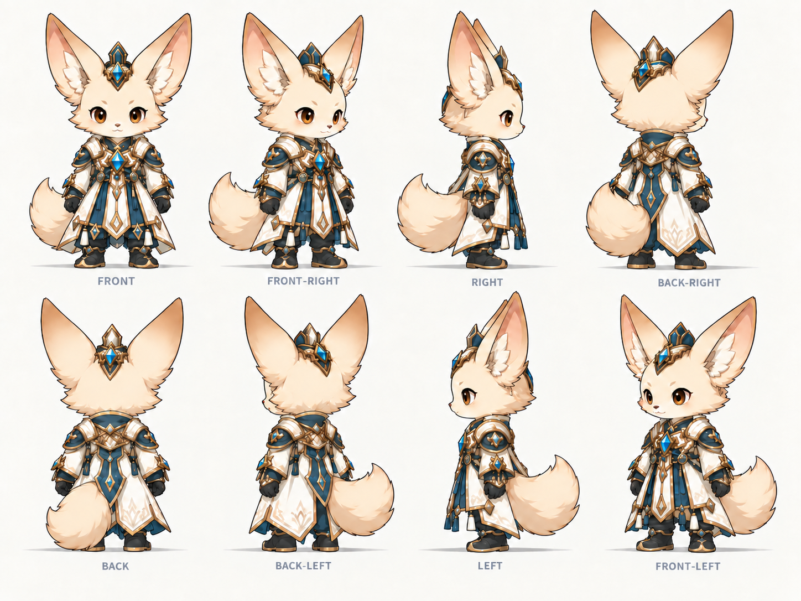

# 미술 기준

맵/환경의 현행 규칙은 [통합 정리](../MAP_RULES_INDEX.md)를 먼저 읽는다. 아래 과거 v2 평가의 '직사각 마당이므로 위험' 해석은 철회되었다.

주인공은 **아래 한 장만 기준**으로 사용한다. 이전 개별8장과 옛 주인공 보드는 현행목록과 새팩에서 제외했다(디스크 삭제는 자동심사 차단).

2026-09-24 사용자가 “제대로된 이미지”로 제공한 원본이다. 위줄 FRONT / FRONT-RIGHT / RIGHT / BACK-RIGHT, 아래줄 BACK / BACK-LEFT / LEFT / FRONT-LEFT. 지팡이·등 두루마리 없음. 큰 귀·꼬리, 아이보리/남청/금/청색 보석, 검정 폐쇄형 신발과 손 시전.

이 파일은 배경·방향 글자가 있는 참고 시트다. 투명 PNG8개/발 기준점/모션이 완성됐다는 뜻은 아니다. 다음 제작은 이 시트의 디자인을 그대로 보존해 게임용8방향을 준비하는 것. 옛 개별4번 수리 작업은 폐기됐으므로 다시 하지 않는다.

## 적·지면 참고

주인공과 다른 용도다. 모두 방향 참고 보드이며 실사용 sprite/반복 texture로 바로 넣지 않는다.

- [배회 적](enemy_wanderer_reference.png) · [돌진 적](enemy_charger_reference.png) · [원거리 적](enemy_ranged_reference.png)
- [흙](surface_dirt_reference.png) · [길](surface_path_reference.png) · [물](surface_water_reference.png) · [포석](surface_paving_reference.png)

원본해시/상태/시트방향과 엔진슬롯 대응은 ASSET_MANIFEST.json. 최종 가독성은 기존 카메라의 실제 크기로 확인한다.

## 배경 장면 기준 — 2026-09-24 재확인
[사용자가 다시 제시한 배경](environment_composition_reference.png)을 배경의 공간감/재질/밀도 비교 기준으로 사용한다. **그림 속 캐릭터와 몬스터는 참고 대상에서 제외**하며 기존 승인 주인공/적 기준을 대체하지 않는다. 원본 바이트 SHA256 DD790368ED84372C24BE742A930DF7D5A2FF91C05E25C3501D7A06F7175094A7.

기존 surface_path 등 B′ 참고와 같은 계열: 사선 시점에서 석축의 윗면/옆면이 함께 읽힘, 식생의 여러 높이와 겹침, 접촉/드리운 그림자, 불규칙 포석과 물가 경계, 밝은 길·어두운 숲·물의 재질 차이. 탑다운 타일 보드나 저해상도 픽셀아트 방향이 아니다. 첨부 한 장으로 정확한 카메라 각도/투영값을 확정하지 않는다.

maps/map_preview의 단색길·저폴리수목·반복바위 테두리는 이동/연결 검토용이며 시각 기준에서 제외한다. 다음 미술 검증은 전체맵 장식 양산 전에 실제카메라의 ‘길+석축+식생+물가’ 한 화면을 이 참고와 대조한다.

## 맵 North Star 시안 — 2026-09-25

[숲 수로 성소 시안과 생성 기록](map_concept_v1/README.md)을 논의용 목표 화면 후보로 추가했다. 캐릭터·적·UI가 없는 실제 플레이 카메라형 환경 컨셉이다. 첨부 참고를 배치 복제하지 않고 첫 숲의 수로·연속 지형·높이층·뿌리 성소로 재구성했다. 아직 사용자 승인, 엔진 구현, 기초 자산 확정 상태가 아니다.

[v2 시안](map_concept_v2/README.md)은 사용자 후속 의견에 따라 더 높은 시점, 더 긴 시야, 큰 형태와 조용한 바닥, 재사용 가능한 모듈 계열을 적용했다. 카메라·밀도·주인공 그림체·생산비는 v1보다 개선됐으나 중앙 직사각 마당과 규칙적인 기둥/계단 반복이 타일맵처럼 읽힐 위험이 있어 미승인 상태다.
